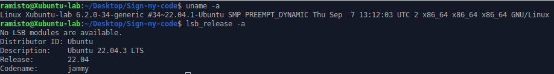
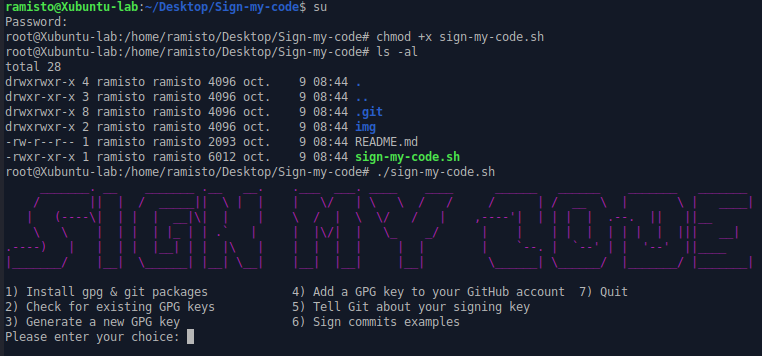
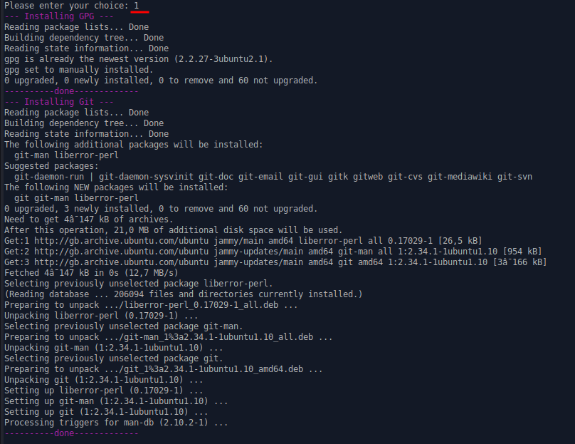

<p align="center" width="100%"></p>
<p align="center">A bash script for sign your commits</p>

<p align="center">
  <a href="#introduction">Introduction</a>
 • <a href="#requirements">Requirements</a>
 • <a href="#usage">Usage</a>
 • <a href="#examples">Examples</a>
  • <a href="#todo">TODO</a>
</p>

# Introduction

This bash script lets you create your GPG key, and configure your git CLI to sign all your commits.

Signing your commits allows your organization to clearly identify you, and thus mitigates the risk of manipulating unauthorized source code.

This script also makes it easier to validate the chapter the "Signing of code" security measure of the OWASP DSOMM model here : 

- [OWASP DSOMM Signing of Code](https://dsomm.owasp.org/activity-description?dimension=Build%20and%20Deployment&subDimension=Build&level=3&activityName=Signing%20of%20code )

Official documentation : 

- [About commit signature verification](https://docs.github.com/en/authentication/managing-commit-signature-verification/about-commit-signature-verification)

# Requirements

- Ubuntu or Debian OS
- gpg
- git
- root privilege


# Usage

```
$ su
$ chmod +x sign-my-code.sh
$ ./sign-my-code.sh

or

$ sudo chmod +x sign-my-code.sh
$ sudo ./sign-my-code.sh

```

### Scenario 1 : You want to sign your commits from scratch

Follow these steps in order :

- Execute this script with root privilege
- Install gpg & git packages
- Generate a new GPG key
- Add a GPG key to your GitHub account
- Tell Git about your signing key
- Sign commits examples
- Quit

### Scenario 2 : You want to sign your commits with an existing GPG key, and GPG/Git packages is already installed

Follow these steps in order :

- Add a GPG key to your GitHub account
- Tell Git about your signing key
- Sign commits examples
- Quit

Other scenarios are possible, just select the option that will help you ;-)

# Examples

Test performed in an Xubuntu 22.04.3 LTS virtualbox machine with root privilege (scenario 1, to sign your commits from scratch).



1) Execute this script : 



2) Install gpg & git packages : 


3) Generate a new GPG key : 



...

# TODO

- Use github cli in the "Add a GPG key to your GitHub account" function to make the process even easier.